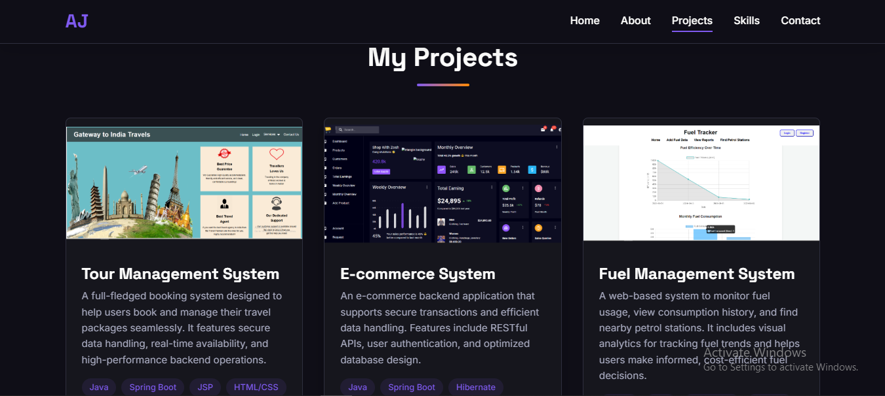
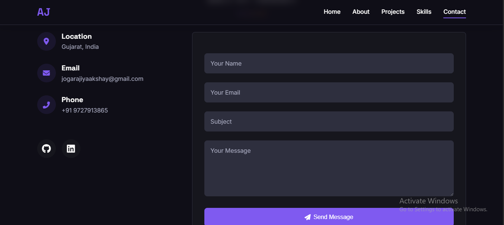

# 🌐 Personal Portfolio Website

Welcome to my personal portfolio website! This project showcases my skills, projects, and background as a web developer. It is built using HTML, CSS, and JavaScript and serves as a digital resume and portfolio.

## 🚀 Features

- Responsive design for all devices
- Smooth scrolling
- Section-based layout: About, Skills, Projects, Contact
- Fully functional contact form
- Social media/profile links

## 🔧 Technologies Used

- HTML5 – Markup structure
- CSS3 – Styling and layout
- JavaScript – Interactivity and DOM manipulation

## 📸 Screenshots

Home Section :     

 

About Section :     

 

Project Section :     

  

Skills Section :     

 

Contact Section :     

 


## 🛠️ Installation & Usage

1. Clone the repository:
   ```bash
      git clone https://github.com/Akshay-Jogarajiya/portfolio

2. Navigate into the folder:
   ```bash
       cd portfolio

3. Open index.html in your browser.


## 🌍 Live Preview
Check out the live version here: https://akshay-jogarajiya.github.io/portfolio/

## 🙋‍♂️ About Me
I'm a passionate developer who loves building clean and functional web experiences. Feel free to connect with me through the contact section or via social links.

## 📬 Contact
Email: jogarajiyaakshay@gmail.com

LinkedIn: https://www.linkedin.com/in/akshay-jogarajiya

GitHub: https://github.com/Akshay-Jogarajiya/

## 📄 License
This project is open source and available under the MIT License.
   
